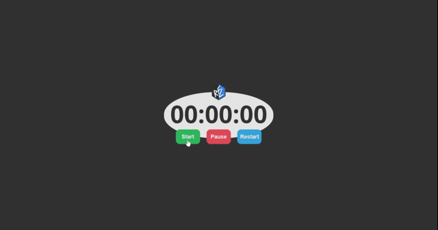
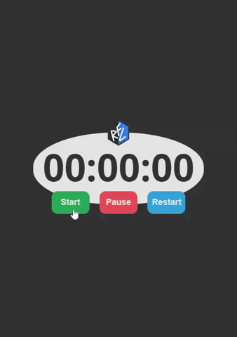

  
  <h1>RFL Timer</h1>

 
  
  
  
  

 <a href="#computer-about">About</a> •
 <a href="#memo-guide">Guide</a> •
 <a href="#movie_camera-demo">Demo</a> •
 <a href="#hammer-technologies">Technologies</a> •
 <a href="#boy-autor">Autor</a> •
 <a href="#page_facing_up-license">License</a>

---
## :computer: About

Timer developed in the basic programming languages of web development for the study of JavaScript DOM and Intervals.

---
## :memo: **Guide**

Click to View

|Status|Plataform|Task|
|:---:|:---:|:---|
|:heavy_check_mark:|:computer::iphone:|Build semantic page HTML|
|:heavy_check_mark:|:computer::iphone:|Build responsive CSS|
|:heavy_check_mark:|:computer:|CSS in BEM|
|:heavy_check_mark:|:computer:|Build JavaScript logic|

---
## :movie_camera: **Demo**

<b> :computer: WEB DESKTOP </b>

<kbd></kbd>

<b> :iphone: WEB MOBILE </b>

<kbd></kbd>

---
## :hammer: **Technologies**

The following tools were used in the build of the project:

|WEB Responsive|
|:---:|
|[HTML5](https://developer.mozilla.org/pt-BR/docs/Web/HTML/HTML5)|
|[CSS3](https://developer.mozilla.org/pt-BR/docs/Archive/CSS3)|
|[JavaScript](https://www.ecma-international.org/publications/standards/Ecma-262.htm)|

---
## :boy: **Autor**

<a href="https://github.com/rafaelfachinelli">
 
 
<b>Rafael Fachinelli</b>
</a>

Developed with ❤️ by Rafael Fachinelli 👋🏽 Contact me!

---
## :page_facing_up: **License**

Copyright © 2020 [Rafael Fachinelli](https://github.com/rafaelfachinelli). 
Project licensed by [MIT](./LICENSE).

---
